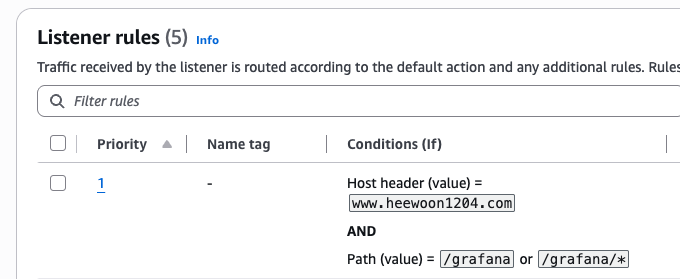

# 그라파나

## 현재 도메인에 그라파나 화면 띄우기

### 1. helm value 수정하기

- root_url : 그라파나가 자신을 /grafana/ 아래에 있는 애플리케이션으로 인식하게함. 
- serve_from_sub_path : sub_path 기준으로 요청을 처리하도록 하는 설정

```bash
# grafana.ini 부분 추가

grafana:
  grafana.ini:
    server:
      root_url: https://www.heewoon1204.com/grafana/
      serve_from_sub_path: true

  nodeSelector:
    eks.amazonaws.com/nodegroup: monitoring

  persistence:
    accessModes:
      - ReadWriteOnce
    enabled: true
    size: 10Gi
    storageClassName: gp3
    type: pvc

  tolerations:
    - effect: NoSchedule
      key: workload
      operator: Equal
      value: monitoring
```
<br>

### 2. helm update 하기

helm을 update하면 그라파나 pod가 재생성됨

```bash
helm upgrade kube-prometheus-stack prometheus-community/kube-prometheus-stack \
  -n monitoring \
  -f kube-prometheus-stack-values.yaml
```
<br>

### 3. ingress에 /grafana 추가하기

monitroing namespace쪽에 있는 pod라서 alb-log-viewer-ingress에 path를 추가해야함 <br>
추가한 다음 apply 하기

```bash
# path: /grafana 추가

apiVersion: networking.k8s.io/v1
kind: Ingress

metadata:
  name: alb-log-viewer-ingress
  namespace: monitoring

  annotations:
    # 기존 ALB와 공유
    alb.ingress.kubernetes.io/group.name: heewoon1204

    # 그룹 우선순위
    alb.ingress.kubernetes.io/group.order: "10"

    alb.ingress.kubernetes.io/target-type: ip

    # 이 Ingress의 Rule을 HTTPS :443 listener에 연결
    alb.ingress.kubernetes.io/listen-ports: '[{"HTTPS":443}]'

    # ExternalDNS
    external-dns.alpha.kubernetes.io/hostname: www.heewoon1204.com

spec:
  ingressClassName: alb

  rules:
    - host: www.heewoon1204.com
      http:
        paths:
          - path: /logs
            pathType: Prefix
            backend:
              service:
                name: alb-log-viewer
                port:
                  number: 80          
          - path: /grafana
            pathType: Prefix
            backend:
              service:
                name: kube-prometheus-stack-grafana
                port:
                  number: 80
```

<br>

### 4. 적용됐는지 확인

ingress ruledp /grafana가 생겼는지 확인하기

```bash
# 확인
kubectl describe ingress alb-log-viewer-ingress -n monitoring

# 결과
Rules:
  Host                 Path  Backends
  ----                 ----  --------
  www.heewoon1204.com  
                       /logs      alb-log-viewer:80 (10.0.4.46:5001)
                       /grafana   kube-prometheus-stack-grafana:80 (10.0.4.55:3000)

```

ALB 리스너에도 rule이 추가됐는지 확인하기

<p align="left">
  
</p>
