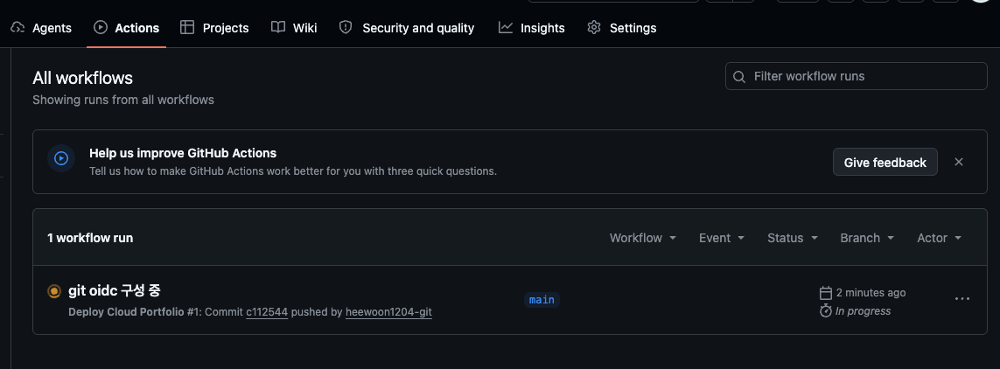

# 배포 자동화 구축

## GitHub OICD 구성하기

GitHub Actions가 AWS Access Key를 들고 있는 대신, GitHub가 발급한 신분증(OIDC 토큰)을 AWS에 보여주고 AWS IAM Role을 잠깐 빌려 쓰는 방식 <br>
장기 Access Key/Secret Key를 GitHub에 저장하지 않아도 됨

```bash
GitHub Actions
      │
      │ OIDC token
      ▼
GitHub OIDC Provider
      │
      ▼
github-actions-cloud-portfolio-role
      │
      ├── ECR Push
      └── EKS Deploy
```

## OIDC구성하기

### 1. AWS IAM에 GitHub OIDC Provider 등록하기

IAM → Identity providers → Add provider

```bash
Provider type : OpenID Connect
Provider URL : https://token.actions.githubusercontent.com
Audience : 
```
<br>

### 2. IAM Role 생성하기

롤을 연결할 때 대상을 잘 선택해야함.<br>
hw_project(프로젝트 repo)의 main 브랜치에서 실행된 github actions만 assumeRole할 수 있도록 설정함.

```bash
# Custom trust policy token.actions.githubusercontent.com:sub에 들어갈 repo id 찾기
curl -s https://api.github.com/repos/heewoon1204-git/hw_project \
| python3 -c '
import sys, json
d=json.load(sys.stdin)
print("owner_id:", d["owner"]["id"])
print("repo_id:", d["id"])
print("created_at:", d["created_at"])
'

# IAM Role
Trusted entity type : Custom trust policy
Custom trust policy : 
     {
     "Version": "2012-10-17",
     "Statement": [
     {
          "Effect": "Allow",
          "Principal": {
          "Federated": "arn:aws:iam::245067526307:oidc-provider/token.actions.githubusercontent.com"
          },
          "Action": "sts:AssumeRoleWithWebIdentity",
          "Condition": {
          "StringEquals": {
               "token.actions.githubusercontent.com:aud": "sts.amazonaws.com",
               "token.actions.githubusercontent.com:sub": "repo:heewoon1204-git@241077901/hw_project@1329305361:ref:refs/heads/main"
          }
          }
     }
     ]
     }
Add permissions : AmazonEC2ContainerRegistryPowerUser
```

heewoon1204-git/hw_project main 브랜치 말고는 해당 role을 사용할 수 없음. <br>
AmazonEC2ContainerRegistryPowerUser : ECR repo에 이미지 push/pull하는데 필요한 권한을 제공함

여기까지 완료했으면 GitHub OIDC → IAM Role 연결까지 완료

```bash
heewoon1204-git/hw_project
        +
      main
        ↓
GitHub Actions
        ↓
AWS IAM Role Assume 가능
```
<br>

### 3. EKS Access Entry

GitHub Actions용 IAM Role을 EKS에 access entry로 등록함

EKS → Clusters → hw-infra-eks-cluster → Access → IAM access entries Create

```bash
# AmazonEKSAdminPolicy 권한이 넒어서 추후 Role/RoleBinding 방식으로 좁혀야함
IAM principal : 위에서 생성한 IAM ARN 입력하기
Type :  Standard
Policy name : AmazonEKSAdminPolicy
Access scope : Kubernetes namespace
Namespace : application
```

현재 구조

```bash
GitHub Actions
     ↓ OIDC
IAM Role
github-actions-hw-project
     ↓
EKS Access Entry
     ↓
AmazonEKSAdminPolicy
     ↓
namespace: application
     ↓
cloud-portfolio Deployment
Service
Ingress
```

## CI/CD Workflow 만들기

### 1. IAM Role에 Policy 추가하기

지금까지 설정한 것은 kubectl로 실제 배포할 수 있는 권한을 만들었다면, 지금은 kubeconfig를 만드는 AWS API 호출에 필요한 권한을 추가함.

위에서 만든 IAM Role에 policy를 추가함.

```bash
{
  "Version": "2012-10-17",
  "Statement": [
    {
      "Effect": "Allow",
      "Action": [
        "eks:DescribeCluster"
      ],
      "Resource": "arn:aws:eks:ap-northeast-2:245067526307:cluster/hw-infra-eks-cluster"
    }
  ]
}
```

### 2. GitHub 저장소에 Workflow 만들기

폴더를 만들고 deploy.yml 파일 만들기
```bash
# 폴더 및 파일 생성
.github/
└── workflows/
    └── deploy.yml

# deploy.yml
name: Deploy Cloud Portfolio

on:
  push:
    branches:
      - main

permissions:
  contents: read
  id-token: write

env:
  AWS_REGION: ap-northeast-2
  AWS_ACCOUNT_ID: "245067526307"

  ECR_REPOSITORY: cloud-portfolio

  EKS_CLUSTER_NAME: hw-infra-eks-cluster
  K8S_NAMESPACE: application
  DEPLOYMENT_NAME: cloud-portfolio
  CONTAINER_NAME: cloud-portfolio

jobs:
  deploy:

    runs-on: ubuntu-latest

    steps:

      # ==========================================
      # 1. Checkout
      # ==========================================

      - name: Checkout
        uses: actions/checkout@v6


      # ==========================================
      # 2. AWS OIDC Authentication
      # ==========================================

      - name: Configure AWS credentials
        uses: aws-actions/configure-aws-credentials@v6.2.3
        with:
          role-to-assume: arn:aws:iam::245067526307:role/github-actions-hw-project
          aws-region: ${{ env.AWS_REGION }}


      # ==========================================
      # 3. Verify AWS Identity
      # ==========================================

      - name: Verify AWS identity
        run: |
          aws sts get-caller-identity


      # ==========================================
      # 4. Login to ECR
      # ==========================================

      - name: Login to Amazon ECR
        id: login-ecr
        uses: aws-actions/amazon-ecr-login@v2.1.6


      # ==========================================
      # 5. Build & Push Docker Image
      # ==========================================

      - name: Build and push image

        env:
          ECR_REGISTRY: ${{ steps.login-ecr.outputs.registry }}
          IMAGE_TAG: ${{ github.sha }}

        run: |

          docker build \
            --platform linux/amd64 \
            -t $ECR_REGISTRY/$ECR_REPOSITORY:$IMAGE_TAG \
            ./cloud-portfolio

          docker push \
            $ECR_REGISTRY/$ECR_REPOSITORY:$IMAGE_TAG


      # ==========================================
      # 6. Configure kubectl
      # ==========================================

      - name: Update kubeconfig

        run: |

          aws eks update-kubeconfig \
            --region $AWS_REGION \
            --name $EKS_CLUSTER_NAME


      # ==========================================
      # 7. Deploy to EKS
      # ==========================================

      - name: Deploy to EKS

        env:
          ECR_REGISTRY: ${{ steps.login-ecr.outputs.registry }}
          IMAGE_TAG: ${{ github.sha }}

        run: |

          kubectl set image \
            deployment/$DEPLOYMENT_NAME \
            $CONTAINER_NAME=$ECR_REGISTRY/$ECR_REPOSITORY:$IMAGE_TAG \
            -n $K8S_NAMESPACE


      # ==========================================
      # 8. Wait for Rollout
      # ==========================================

      - name: Wait for rollout

        run: |

          kubectl rollout status \
            deployment/$DEPLOYMENT_NAME \
            -n $K8S_NAMESPACE \
            --timeout=180s


      # ==========================================
      # 9. Verify Deployment
      # ==========================================

      - name: Verify deployment

        run: |

          kubectl get deployment \
            $DEPLOYMENT_NAME \
            -n $K8S_NAMESPACE

          kubectl get pods \
            -n $K8S_NAMESPACE \
            -l app=cloud-portfolio
```

해당 폴더 및 파일을 commit 후 push하면 git Actions 탭에 들어가서 확인하기

<p align="left">
  
</p>


## GitHub Actions Self-hosted Runner 설치

GitHub이 EKS API server로 접근하지 못해서 itHub Actions Self-hosted Runner를 VPC Private Subnet 안에 설치해야함

```bash
GitHub
   │
   │ OIDC
   ▼
IAM Role
   │
   ▼
Private Subnet의 EC2
(Self-hosted Runner)
   │
   ├── NAT Gateway → GitHub
   │
   └── Private EKS API → kubectl
```