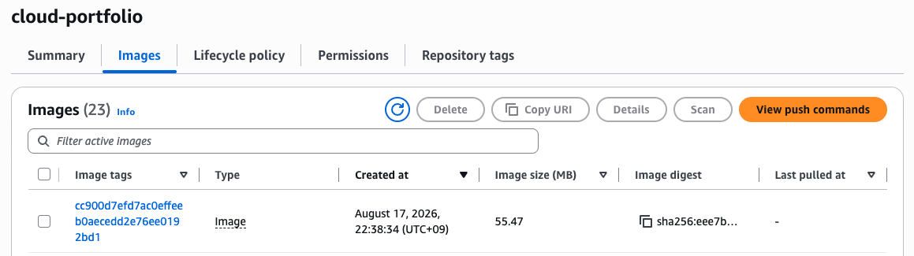

# 배포 자동화 구축

## Argo CD 

Argo CD를 이용해 배포하면 GitHub Actions가 EKS API에 접근하지 않아도됨. <br>
Argo CD가 EKS 내부에서 Kubernetes API와 통신하기 때문.

```bash
                GitHub
                  │
                git push
                  │
                  ▼
        ┌────────────────────┐
        │   GitHub Actions   │
        │                    │
        │  ① Test            │
        │  ② Docker Build    │
        │  ③ ECR Push        │
        └─────────┬──────────┘
                  │
                  ▼
                 ECR
                  │
                  │
        Git Manifest 변경
                  │
                  ▼
        ┌────────────────────┐
        │      Argo CD       │
        │       in EKS       │
        └─────────┬──────────┘
                  │
                  ▼
                 EKS
                  │
          cloud-portfolio
```

## Argo CD 적용하기

### 1. 기존 GitHub Actions를 CI-only로 바꾸기

이전에는 기존 GitHub Actions으로 CD까지 하려고 했지만, 네트워크 접속 이슈로 Argo CD로 CD를 할것이기 때문에 기존 Actions를 변경해야함. <br>
GitHub Actions은 ECR push 까지만 진행함

```bash
# 변경 후 
name: Build and Push Cloud Portfolio

on:
  push:
    branches:
      - main
    paths:
      - "cloud-portfolio/**"

permissions:
  contents: read
  id-token: write

env:
  AWS_REGION: ap-northeast-2
  AWS_ACCOUNT_ID: "245067526307"
  ECR_REPOSITORY: cloud-portfolio

jobs:
  build-and-push:

    runs-on: ubuntu-latest

    steps:

      # ==========================================
      # 1. Checkout
      # ==========================================

      - name: Checkout
        uses: actions/checkout@v6


      # ==========================================
      # 2. AWS OIDC Authentication
      # ==========================================

      - name: Configure AWS credentials
        uses: aws-actions/configure-aws-credentials@v6.2.3
        with:
          role-to-assume: arn:aws:iam::245067526307:role/github-actions-hw-project
          aws-region: ${{ env.AWS_REGION }}


      # ==========================================
      # 3. Verify AWS Identity
      # ==========================================

      - name: Verify AWS identity
        run: |
          aws sts get-caller-identity


      # ==========================================
      # 4. Login to ECR
      # ==========================================

      - name: Login to Amazon ECR
        id: login-ecr
        uses: aws-actions/amazon-ecr-login@v2.1.6


      # ==========================================
      # 5. Build and Push Docker Image
      # ==========================================

      - name: Build and push image

        env:
          ECR_REGISTRY: ${{ steps.login-ecr.outputs.registry }}
          IMAGE_TAG: ${{ github.sha }}

        run: |

          docker build \
            --platform linux/amd64 \
            -t $ECR_REGISTRY/$ECR_REPOSITORY:$IMAGE_TAG \
            ./cloud-portfolio

          docker push \
            $ECR_REGISTRY/$ECR_REPOSITORY:$IMAGE_TAG
```
<br>

### 2. 변경한 내용 push 후 Actions 확인하기

파일 수정 후 git push했을 때 gitActions에 의해 ECR에 자동으로 이미지가 배포된 것을 확인함

<p align="left">
  
</p>

<br>

### 3. Kubernetes manifest를 Git에서 관리하는 구조로 정리하기

```bash
# 목표 구조
hw_project/
├── .github/
│   └── workflows/
│       └── deploy.yml          # CI: 테스트 + Docker build + ECR push
│
├── cloud-portfolio/
│   ├── app.py
│   ├── Dockerfile
│   ├── requirements.txt
│   └── templates/
│
└── k8s/
    └── cloud-portfolio/
        ├── deployment.yaml
        ├── service.yaml
        └── ingress.yaml

# 목표 역할 분리
cloud-portfolio/** 수정
        ↓
GitHub Actions
        ↓
   Docker → ECR


    k8s/** 수정
        ↓
     Argo CD
        ↓
       EKS
```

Argo CD가 바라볼 manifest 경로 폴더 생성하기

```bash
hw_project/
├── .github/
│   └── workflows/
├── cloud-portfolio/
└── k8s/
    └── cloud-portfolio/
```

그 다음 deployment.yaml 파일 생성하기 <br>
"kubectl get deployment -o yaml"로 현재 yaml 파일보면 내용이 많지만, 현재 클러스터가 관리하는 값들이 추가적으로 나오는거라 git에 전부 저장할 필요가 없음.

Git에는 "원하는 상태(desired state)"만 넣음!! 

```bash
apiVersion: apps/v1
kind: Deployment

metadata:
  name: cloud-portfolio
  namespace: application

spec:
  replicas: 2

  selector:
    matchLabels:
      app: cloud-portfolio

  template:
    metadata:
      labels:
        app: cloud-portfolio

    spec:
      containers:
        - name: cloud-portfolio

          image: 245067526307.dkr.ecr.ap-northeast-2.amazonaws.com/cloud-portfolio:cc900d7efd7ac0effeeb0aecedd2e76ee0192bd1

          ports:
            - containerPort: 5001
              protocol: TCP

          envFrom:
            - secretRef:
                name: cloud-portfolio-db

          resources:
            requests:
              cpu: 100m
              memory: 128Mi

            limits:
              cpu: 500m
              memory: 512Mi
```

Service도 같이 생성하기