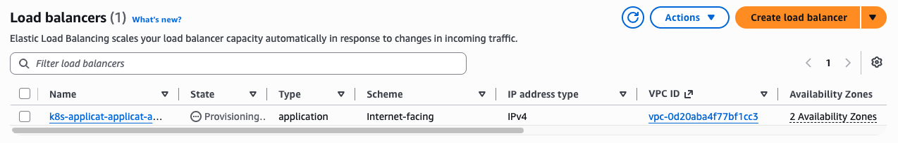
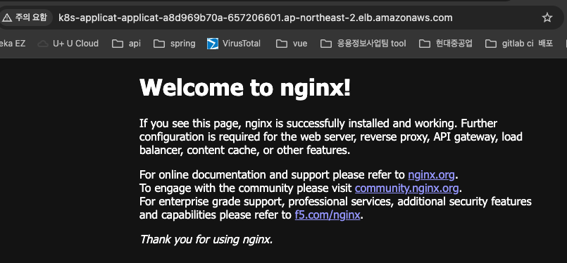

# 쿠버네티스 리소스 구성

## 1. namespace 만들기

### application, monitoring namespace 생성

```bash
# 생성
kubectl create namespace application
kubectl create namespace monitoring

# 확인
kubectl get namespaces
```
<br><br>

## 2. Deployment 만들기

### Deployment 생성

application Namespace에 nginx Pod 2개 생성

```bash
# nginx-deployment.yaml

apiVersion: apps/v1
kind: Deployment
metadata:
  name: nginx
  namespace: application
spec:
  replicas: 2
  selector:
    matchLabels:
      app: nginx
  template:
    metadata:
      labels:
        app: nginx
    spec:
      containers:
        - name: nginx
          image: nginx:latest
          ports:
            - containerPort: 80

# yaml 실행
kubectl apply -f nginx-deployment.yaml
```

application에 pod가 잘 생성됨

```bash
# 명령어
kubectl get pods -n application -o wide

# 결과
NAME                     READY   STATUS    RESTARTS   AGE   IP           NODE                                           NOMINATED NODE   READINESS GATES
nginx-59f86b59ff-swwpk   1/1     Running   0          68s   10.0.2.80    ip-10-0-2-8.ap-northeast-2.compute.internal    <none>           <none>
nginx-59f86b59ff-tg8kl   1/1     Running   0          68s   10.0.4.161   ip-10-0-4-20.ap-northeast-2.compute.internal   <none>           <none>
```

<br>

### nginx Service 만들기

```bash
# nginx-service.yaml

apiVersion: v1
kind: Service
metadata:
  name: nginx
  namespace: application
spec:
  selector:
    app: nginx
  ports:
    - port: 80
      targetPort: 80
  type: ClusterIP

# 실행
kubectl apply -f nginx-service.yaml
```

service 생성 완료

```bash
# 확인
kubectl get svc -n application

# 결과
NAME    TYPE        CLUSTER-IP      EXTERNAL-IP   PORT(S)   AGE
nginx   ClusterIP   172.20.14.158   <none>        80/TCP    25s
```

service가 pod를 제대로 찾고 있는지 확인

```bash
# 확인
kubectl get endpoints -n application

# 결과
# endpoint에 nginx pod 2개 있는거 확인
NAME    ENDPOINTS                    AGE
nginx   10.0.2.80:80,10.0.4.161:80   3m17s
```

<br><br>

## 3. Ingress + ALB 만들기

최종 구조
```bash
EKS Cluster
│
├── kube-system
│     │
│     └── aws-load-balancer-controller
│             │
│             │ ServiceAccount:
│             │ aws-load-balancer-controller
│             ▼
│       Pod Identity Association
│             │
│             ▼
│       IAM Role
│       AmazonEKSLoadBalancerControllerRole
│             │
│             ▼
│       AWSLoadBalancerControllerIAMPolicy
│             │
│             ▼
│       ALB / Target Group / SG 관리
```

### 1. IAM Policy 생성하기

AWS Load Balancer Controllerrk AWS에서 무엇을 할 수 있는지를 정의하는 권한 생성해야함.

AWS Load Balancer Controller 공식 IAM Policy 전체를 사용해서 만들어야함.<br>
controller가 ALB, Target Group, Security Group 등의 AWS 리소스를 관리하기 때문에 필요한 권한이 많음.

공식 정책을 가지고 와서 json으로 붙여넣기!

```bash
# 공식 설치 문서 내려받기
curl -O https://raw.githubusercontent.com/kubernetes-sigs/aws-load-balancer-controller/v2.14.1/docs/install/iam_policy.json

# iam_policy.json 문서 다운받아짐.
다은 받아진 json 파일 내용을 복사해서 IAM Policy editor에 붙여넣기
```
<br>

### 2. AWS Load Balancer Controller 용 IAM 생성하기

aws service에서 사용할게 아니라 eks pod identity에 붙일 role을 만들어야함.

- Pod Identity : AWS IAM 권한을 Pod에 연결하는 기능/방식

```bash
Trusted entity type : Custom trust policy
Custom trust policy : 
        {
        "Version": "2012-10-17",
        "Statement": [
            {
            "Sid": "AllowEksAuthToAssumeRoleForPodIdentity",
            "Effect": "Allow",
            "Principal": {
                "Service": "pods.eks.amazonaws.com"  ----> EKS Pod Identity가 이 Role을 사용할 수 있도록 허용하는 주체
            },
            "Action": [
                "sts:AssumeRole",      -------------------> Role을 가져오는 권한
                "sts:TagSession".      -------------------> Pod Identity가 세션 태그를 전달하기 위해 필요
            ]
            }
        ]
        }
Permissions policies : 위에서 만들었던 policy 선택
```

생성한 뒤 role 구성

```bash
hwAmazonEKSLoadBalancerControllerRole -------------> 새로 만든 role
        │
        ├── Trust Policy
        │      └── pods.eks.amazonaws.com
        │
        └── Permission Policy
               └── hwAWSLoadBalancerControllerIAMPolicy. -> 새로 만든 policy
```

<br>


### 3. ServiceAccount 생성하기

Controller는 kube-system namespace에 생성함

```bash
# 생성
kubectl create serviceaccount aws-load-balancer-controller \
  -n kube-system

# 확인
kubectl get serviceaccount -n kube-system aws-load-balancer-controller
```

### 4. EKS Pod Identity Association 생성하기

IAM Role ↔ Kubernetes ServiceAccount를 연결하는 작업 <br>
-> ServiceAccount에 annotation으로 IAM ROLE ARN을 넣는것이 아니라 EKS POD Identity Association 자체로 연결

EKS → Clusters → hw-infra-eks-cluster → Access -> Pod Identity associations -> Create


### 5. AWS Load Balancer Controller 생성하기

Helm으로 생성할거기 때문에 사전에 Helm이 설치되어있는지 확인해야함

```bash
# helm chart 저장소 등록
helm repo add eks https://aws.github.io/eks-charts

# 업데이트
helm repo update eks

# 버전 확인
helm search repo eks/aws-load-balancer-controller

# 설치
helm install aws-load-balancer-controller eks/aws-load-balancer-controller \
  -n kube-system \
  --set clusterName=hw-infra-eks-cluster \             ----------> 내 eks cluster 이름 넣기
  --set serviceAccount.create=false \               -------------> serviceAccount를 미리 생성했기 때문에 false
  --set serviceAccount.name=aws-load-balancer-controller \.  ----> 기생성한 serviceAccount 이름 넣기
  --version 3.5.0
```

### 6. Ingress 생성 및 ALB 생성하기

Ingress : 이 HTTP 요청을 이 Service로 보내라고 선언하는 리소스로, AWS Load Balancer Controller가 이거보고 ALB 생성함

```bash
# ingress yaml
apiVersion: networking.k8s.io/v1
kind: Ingress
metadata:
  name: application-ingress
  namespace: application
  annotations:
    alb.ingress.kubernetes.io/scheme: internet-facing
    alb.ingress.kubernetes.io/target-type: ip
spec:
  ingressClassName: alb
  rules:
    - http:
        paths:
          - path: /
            pathType: Prefix
            backend:
              service:
                name: nginx  ---------> 내가 생성한 service 이름
                port:
                  number: 80
                
# ingress.yaml 실행
kubectl apply -f ingress.yaml

# 확인
kubectl get ingress -n application

# 결과
# ADDRESS가 ALB DNS 주소
NAME                  CLASS   HOSTS   ADDRESS                                                                       PORTS   AGE
application-ingress   alb     *       k8s-applicat-applicat-a8d969b70a-657206601.ap-northeast-2.elb.amazonaws.com   80      63s
```

AWS Console에서 확인해보면 ALB가 생성중!!

<p align="left">
  
</p>

생성이 완료되면 ALB DNS name으로 접속해서 nginx service로 잘 접속되는지 확인해보기

<p align="left">
  
</p>
