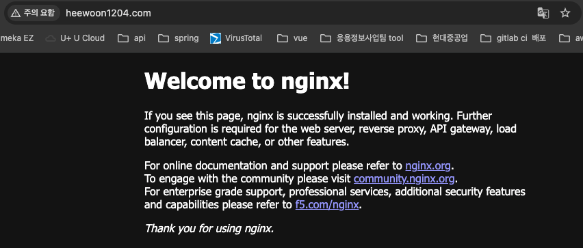
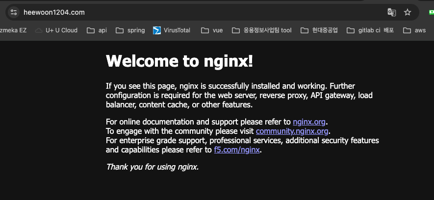
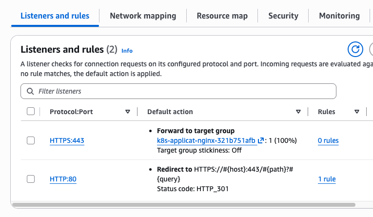

# 도메인 접속 구성하기

## Route 53에 ALB 연결하기

### 사용가능한 도메인 확인

기존에 구매해둔 도메인이 Route5 3 Hosted zones에 등록되어있음.

### 도메인 레코드 추가

해당 도메인 레코드에 A type으로 새로 만들어진 ALB를 연결해줌

도메인으로 접속해서 nginx로 요청이 잘 가는지 확인하기 
아직 인증서를 추가하지 않아서 "주의요함"이 뜨는 상태

  

  

## ACM 인증서를 ALB에 연결하기

ALB에 들어가서 HTTPS Listeners and rules를 추가해줌

ALB security group에 HTTPS(443) inbound 추가해줌

다시 도메인에 접속해보면, "주의요함" 없이 https로 접속이 잘 됨

  

  

### HTTP 요청을 HTTPS로 Redirect 시키기

ALB Listeners and rules에서 HTTP :80 Listener의 default action을 수정해야함.

| 항목          | 값          |
| ----------- | ---------- |
| Action type    | Redirect to URL    |
| Protocol    | HTTPS   |
| Port        | 443      |
| Host        | #{host}  |
| Path        | /#{path} |
| Query       | #{query} |
| Status code | HTTP_301 |

 

  

