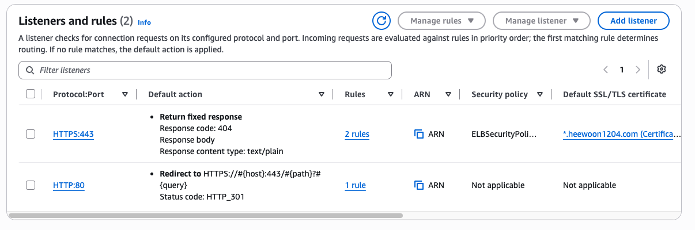
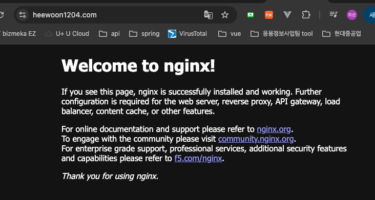

# 도메인 접속 구성하기

## https 리스너 설정 부분 수정하기

1. 기존 설정했던 방식은 Ingress.yaml에 http 정보만 있어서 https 리스너를 수동으로 ACM 연결해서 만들어줬었음. 
2. http로 접속하면 https로 리다이렉트 되는 설정도 수동으로 설정했었음. 
3. heewoon1204.com -> www.heewoon1204.com 리다이렉트 설정도 추가했음.

이 부분을 Ingress.yaml 수정해서 수동 작업을 없애줄 것

### 1. application yaml 수정

```bash
apiVersion: networking.k8s.io/v1
kind: Ingress

metadata:
  name: application-ingress
  namespace: application

  annotations:
    # ALB
    alb.ingress.kubernetes.io/scheme: internet-facing
    alb.ingress.kubernetes.io/target-type: ip

    # IngressGroup
    alb.ingress.kubernetes.io/group.name: heewoon1204

    # 우선순위
    alb.ingress.kubernetes.io/group.order: "100"


    # HTTP :80 + HTTPS :443
    alb.ingress.kubernetes.io/listen-ports: '[{"HTTP":80},{"HTTPS":443}]'

    # ACM 인증서
    alb.ingress.kubernetes.io/certificate-arn: "arn:aws:acm:ap-northeast-2:245067526307:certificate/2ed35465-7537-4d37-94b8-caa702c8140f"

    # HTTP → HTTPS redirect
    alb.ingress.kubernetes.io/ssl-redirect: "443"

    # ExternalDNS
    external-dns.alpha.kubernetes.io/hostname: www.heewoon1204.com

    # apex domain → www redirect
    alb.ingress.kubernetes.io/actions.redirect-to-www: >
      {
        "type": "redirect",
        "redirectConfig": {
          "protocol": "HTTPS",
          "host": "www.heewoon1204.com",
          "path": "/#{path}",
          "query": "#{query}",
          "statusCode": "HTTP_301"
        }
      }

spec:
  ingressClassName: alb

  rules:
    - host: heewoon1204.com
      http:
        paths:
          - path: /
            pathType: Prefix
            backend:
              service:
                name: redirect-to-www
                port:
                  name: use-annotation


    - host: www.heewoon1204.com
      http:
        paths:
          - path: /
            pathType: Prefix
            backend:
              service:
                name: nginx
                port:
                  number: 80
```

<br>

### 2. alb-log-viewer ingress yaml 수정

Ingress group 우선순위 추가함 <br>
listen-ports 추가함

```bash
apiVersion: networking.k8s.io/v1
kind: Ingress

metadata:
  name: alb-log-viewer-ingress
  namespace: monitoring

  annotations:
    # 기존 ALB와 공유
    alb.ingress.kubernetes.io/group.name: heewoon1204

    # 그룹 우선순위
    alb.ingress.kubernetes.io/group.order: "10"

    alb.ingress.kubernetes.io/target-type: ip

    # 이 Ingress의 Rule을 HTTPS :443 listener에 연결
    alb.ingress.kubernetes.io/listen-ports: '[{"HTTPS":443}]'

    # ExternalDNS
    external-dns.alpha.kubernetes.io/hostname: www.heewoon1204.com

spec:
  ingressClassName: alb

  rules:
    - host: www.heewoon1204.com
      http:
        paths:
          - path: /logs
            pathType: Prefix
            backend:
              service:
                name: alb-log-viewer
                port:
                  number: 80
```
<br>

### 3. apply 후 체크

ingress가 같은 ALB를 보는지 확인하기

```bash
# 확인
kubectl get ingress -A

# 결과
NAMESPACE     NAME                     CLASS   HOSTS                 ADDRESS                                                                 PORTS   AGE
application   application-ingress      alb     www.heewoon1204.com   k8s-heewoon1204-84896dc8ab-332212910.ap-northeast-2.elb.amazonaws.com   80      51m
monitoring    alb-log-viewer-ingress   alb     www.heewoon1204.com   k8s-heewoon1204-84896dc8ab-332212910.ap-northeast-2.elb.amazonaws.com   80      40h
```

ALB 리스너에 htts가 인증서와 함께 추가됐는지 확인하기 <br>
http 인증서에는 리다이렉트 규칙이 생겼는지 확인하기

<p align="left">
  
</p>

<br>

### 4. 접속 확인 

https로 접속 후 "주의요함"이 안뜨는지 확인 완료 <br>
http로 접속했을 때 https로 리다이렉트되는지 확인 완료

<p align="left">
  
</p>