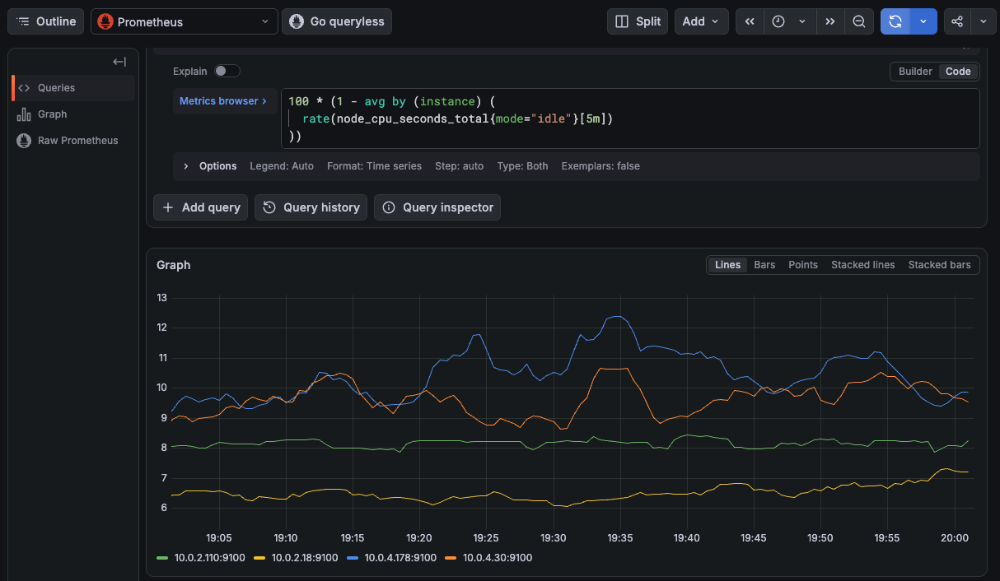
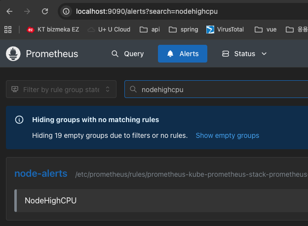

# 모니터링 구성

## Prometheus 설치

kube-prometheus-stack로 설치. <br>
이 차트 하나로 Prometheus, Grafana, Alertmanager와 kube-state-metrics, node-exporter 등을 함께 구성할 수 있음.

### 1. Helm repo 추가

```bash
# repo 추가
helm repo add prometheus-community https://prometheus-community.github.io/helm-charts

# 추가됐는지 확인
helm search repo prometheus-community/kube-prometheus-stack

# repo update
helm repo update
```
<br>

### 2. 모니터링 namespace 생성

```bash
# 생성
kubectl create namespace monitoring
```
<br>

### 3. yaml 파일 생성

```bash
prometheus:
  prometheusSpec:
    nodeSelector:
      eks.amazonaws.com/nodegroup: monitoring  ------> 모니터링 노드 그룹으로 보냄

    tolerations:
      - key: workload
        operator: Equal
        value: monitoring                -----------> 모니터링 노드 그룹은 taints 설정이 되어있기 때문에 쫓겨나지 않게 tolerations 설정
        effect: NoSchedule

grafana:
  nodeSelector:
    eks.amazonaws.com/nodegroup: monitoring

  tolerations:
    - key: workload
      operator: Equal
      value: monitoring
      effect: NoSchedule

alertmanager:
  alertmanagerSpec:
    nodeSelector:
      eks.amazonaws.com/nodegroup: monitoring

    tolerations:
      - key: workload
        operator: Equal
        value: monitoring
        effect: NoSchedule
```
<br>

### 4. helm으로 설치

-f : kube-prometheus-stack 차트의 기본 설정값에 네가 만든 YAML을 덮어씌워서 설치함

```bash
# 설치
helm install kube-prometheus-stack \
  prometheus-community/kube-prometheus-stack \
  -n monitoring \
  -f kube-prometheus-stack-values.yaml

  # 확인
  # STATUS가 deployed인지 확인
  helm list -n monitoring
```

정상적으로 설치됐는지 확인하기

```bash
# 확인
kubectl get svc -n monitoring

# 결과
NAME                                             TYPE        CLUSTER-IP       EXTERNAL-IP   PORT(S)                      AGE
alertmanager-operated                            ClusterIP   None             <none>        9093/TCP,9094/TCP,9094/UDP   3h37m
kube-prometheus-stack-alertmanager               ClusterIP   172.20.235.145   <none>        9093/TCP,8080/TCP            3h37m
kube-prometheus-stack-grafana                    ClusterIP   172.20.167.126   <none>        80/TCP                       3h37m
kube-prometheus-stack-kube-state-metrics         ClusterIP   172.20.20.130    <none>        8080/TCP                     3h37m
kube-prometheus-stack-operator                   ClusterIP   172.20.87.218    <none>        443/TCP                      3h37m
kube-prometheus-stack-prometheus                 ClusterIP   172.20.73.183    <none>        9090/TCP,8080/TCP            3h37m
kube-prometheus-stack-prometheus-node-exporter   ClusterIP   172.20.115.76    <none>        9100/TCP                     3h37m
prometheus-operated                              ClusterIP   None             <none>        9090/TCP                     3h37m
```
<br>

### 5. 그라파나 접속하기

정상적으로 동작하는지 확인하기 위해서 내 pc와 그라파나 포트포워딩을 진행함

```bash
# 포트포워딩
kubectl port-forward \
  svc/kube-prometheus-stack-grafana \
  -n monitoring 3000:80

# 접속해보기
http://localhost:3000
```
화면 접속에 성공했으면 로그인 정보 찾아야함 <br>
보통 계정명은 "admin"이고 비밀번호는 secret에 들어있음

```bash
# 그라파나 비밀번호 찾기
kubectl get secret kube-prometheus-stack-grafana \
  -n monitoring \
  -o jsonpath="{.data.admin-password}" | base64 --decode

# 결과 맨 끝에 붙는 % -> 이거는 뺀 나머지가 비밀번호!
```

로그인이 성공했으면 프로메테우스에서 데이터 받아오고 있는지 확인이 필요함<br>
Connections → Data sources → Prometheus 선택 → Test 진행해서 성공하는지 확인하기

<p align="left">
  
</p>

<br>

### 6. 그라파나에 EBS 붙이기

pod가 재생성되어도 그라파나 데이터를 계속 유지하기 위해서는 EBS를 붙여줘야함

기존 In-gress 방식 storageclass가 아니라 EBS CSI를 사용할 것이기 때문에 설치부터 진행

```bash
Grafana
   │
   │ PVC 요청
   ↓
PersistentVolumeClaim
   │
   ↓
StorageClass (gp3)
   │
   ↓
EBS CSI Driver
   │
   ↓
AWS EBS gp3
```

1. EBS CSI Driver 설치

    ```bash
    aws eks create-addon \
      --cluster-name hw-infra-eks-cluster \
      --addon-name aws-ebs-csi-driver \
      --region ap-northeast-2
    ```

2. gp3 StorageClass 만들기

    현재 In-tress로 설치되어있는 StorageClass는 gp2. gp3를 새로 만들어야함

    ```bash
    # yaml 생성
    apiVersion: storage.k8s.io/v1
    kind: StorageClass
    metadata:
      name: gp3
    provisioner: ebs.csi.aws.com
    volumeBindingMode: WaitForFirstConsumer
    allowVolumeExpansion: true
    parameters:
      type: gp3
      fsType: ext4
    reclaimPolicy: Delete

    # 실행
    kubectl apply -f gp3-storageclass.yaml

    # 생성 확인
    kubectl get storageclass

    # 결과
    # PROVISIONER이 In-tree가 아니라 ebs csi 확인
    NAME   PROVISIONER             RECLAIMPOLICY   VOLUMEBINDINGMODE      ALLOWVOLUMEEXPANSION   AGE
    gp2    kubernetes.io/aws-ebs   Delete          WaitForFirstConsumer   false                  2d23h
    gp3    ebs.csi.aws.com         Delete          WaitForFirstConsumer   true                   22s
    ```

3. 그라파나 연결

    기존에 생성해뒀던 helm valus 파일 수정 후 업그레이드 해주기

    ```bash
    # 그라파나쪽에 볼륨 내용 추가
      persistence:
        enabled: true
        type: pvc
        storageClassName: gp3
        accessModes:
          - ReadWriteOnce
        size: 10Gi

    # 수정한 내용 토대로 업그레이드
    helm upgrade kube-prometheus-stack \
      prometheus-community/kube-prometheus-stack \
      -n monitoring \
      -f kube-prometheus-stack-values.yaml

    # PVC 생성 확인
    kubectl get pvc -n monitoring

    # 결과
    NAME                            STATUS   VOLUME                                     CAPACITY   ACCESS MODES   STORAGECLASS   VOLUMEATTRIBUTESCLASS   AGE kube-prometheus-stack-grafana   Bound    pvc-8845531c-282d-46a5-9f6b-c5edd0ce5b4b   10Gi       RWO            gp3            <unset>                 71s


    # pod에도 mount 됐는지 확인
    Volumes:
      config:
        Type:      ConfigMap (a volume populated by a ConfigMap)
        Name:      kube-prometheus-stack-grafana
        Optional:  false
      storage:
        Type:       PersistentVolumeClaim (a reference to a PersistentVolumeClaim in the same namespace)
        ClaimName:  kube-prometheus-stack-grafana
        ReadOnly:   false
    ```


<br>

  
### 7. Alertmanager 구성하기

```bash
Prometheus
   ↓
Pending
   ↓ 5
Firing 
   ↓
Alertmanager
```

node CPU가 5분동안 80%이상일때 alter이 오게끔하는 PrometheusRule 만들기

```bash
# rule yaml
apiVersion: monitoring.coreos.com/v1
kind: PrometheusRule
metadata:
  name: node-cpu-alert
  namespace: monitoring
  labels:
    release: kube-prometheus-stack
spec:
  groups:
    - name: node-alerts
      rules:
        - alert: NodeHighCPU
          expr: |
            100 - (
              avg by(instance) (
                rate(node_cpu_seconds_total{mode="idle"}[5m])
              ) * 100
            ) > 80
          for: 5m
          labels:
            severity: warning
          annotations:
            summary: "Node CPU usage is high"
            description: "Node {{ $labels.instance }} CPU usage has been above 80% for 5 minutes."

# 적용하기
kubectl apply -f node-cpu-alert.yaml

# 생성됐는지 확인
kubectl get prometheusrule -n monitoring | grep node-cpu
```

룰이 프로메테우스에 등록됐는지 확인해보기

```bash
# 프로메테우스 UI 접속을 위해 포트포워딩
kubectl port-forward \
  svc/kube-prometheus-stack-prometheus \
  -n monitoring 9090:9090
```

<p align="left">
  
</p>
