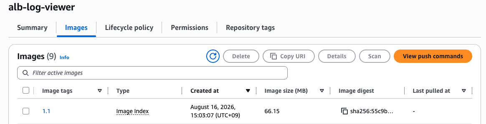

# ALB log를 화면에서 간편하게 보여주기

## 소스 수정 후 ECR에 재배포하기

현재 alb-log-viewer 소스에는 route가 / 로 설정되어있는데, 기존 ALB를 같이쓰게 되면서 해당 화면은 /log를 통해 들어가게 되었음 <br>
따라서 소스 수정한 다음 1.1로 재배포 해야하는 상황

### 1. 소스 수정하기

기존 소스는 유지하면서 /log 라우트만 추가했음.

```bash
# 기존
@app.route("/")
def index():

# 수정
@app.route("/")
@app.route("/logs")
def index():
```

 라우트를 추가해주면 404 화면이 더이상 뜨지 않음

 ```bash
 https://www.heewoon1204.com/
        ↓
      nginx

https://www.heewoon1204.com/logs
        ↓
       ALB
        ↓
alb-log-viewer Service
        ↓
   Flask /logs
        ↓
ALB Log Viewer ✅
 ```
<br>

### 2. 재배포하기

기존 1.0으로 배포했고, 지금은 소스 수정이 됐으니 1.1로 배포함

```bash 
docker buildx build \
  --platform linux/amd64 \
  -t 245067526307.dkr.ecr.ap-northeast-2.amazonaws.com/alb-log-viewer:1.1 \
  --push \
  .
```

배포가 완료되면 AWS ECR에 1.1 버전으로 이미지가 새로 올라간 것을 확인

<p align="left">
  
</p>

<br>

### 3. Deployment의 이미지 버전을 1.1로 변경

Deployment에서 이미지를 1.0 -> 1.1로 변경한 다음 apply 하기

```bash 
    spec:
      serviceAccountName: alb-log-viewer-sa
      containers:
        - name: alb-log-viewer
          image: 245067526307.dkr.ecr.ap-northeast-2.amazonaws.com/alb-log-viewer:1.1
          ports:
            - containerPort: 5001
```